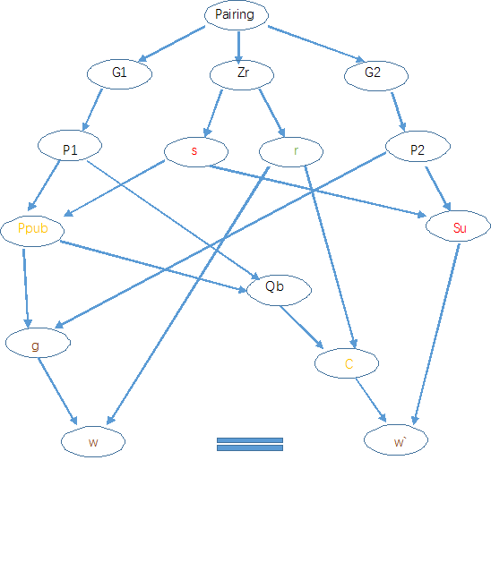

<<<<<<< HEAD
#核心原理
* 椭圆曲线的不可逆性   即r * P -> Q   但 Q + P /-> r
* 双线性对的运算  e(a*P,b*Q) = e(P,Q)^(a*b)

#JPBC库
* Pairing 表示双线性对  有G1  G2  GT 和 Zr 4个元素
* Field  表示群   
* Element 表示 G中的点   Zr中的数
* Element 运算  invert 求逆  add(加群  同类型的element的加法)  mul(同类型的Element的运算)  mulZn(G1中的点乘Zr的数)

#SM9 3大算法

* 秘钥封装    加解密
* 秘钥交换
* 数字签名

#SM9 应用
* 首先写一下应用原理
    * alice 用 bob 的id加密了一份文件传给了bob.
    * bob 收到文件后 没有秘钥 并不能解密
    * bob 向KGC 验证身份 获取私钥
    * KGC 通过 bob的身份认证，将私钥发给bob bob解密
* 与pki不同点在于 受信任的服务器 处理计算获取私钥的任务 
* pki 则是 保存用户的公钥证书  私钥有用户保存

#SM9 疑惑与问题
* 如何做到Ppub与id的相互转化 即SM9也会产生Ppub,    
  其实现也是通过Ppub加密的，那和SM2有什么区别，id也没有什么作用
* 如何更新公钥与id
=======
# GMSMAlgorithm
java 实现国密商密算法
>>>>>>> 5fef587cae3095c2cc142914ddb6ca15ea6d7bc9
